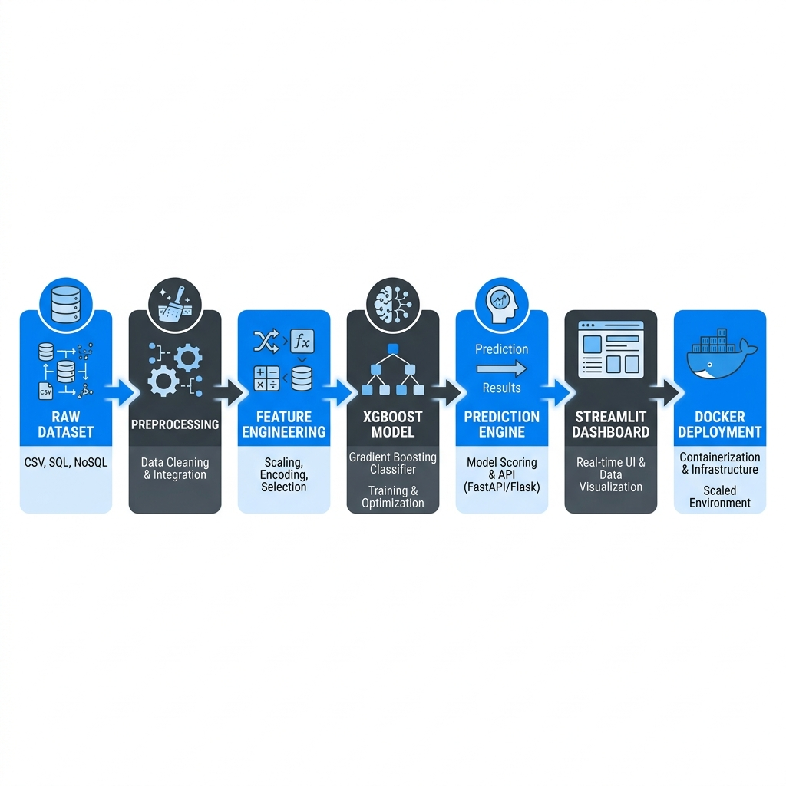

# 🌊 FloodGuard: AI-Powered Flood Risk Prediction & Early Warning System

[](https://www.python.org/)
[](https://streamlit.io/)
[](https://xgboost.readthedocs.io/)
[](https://www.docker.com/)
[](LICENSE)

An intelligent, end-to-end machine learning system that predicts urban flood risk severity classes in real-time. By combining simulated meteorological weather inputs with geospatial elevation and terrain slope data, FloodGuard calculates localized flood hazards and renders them dynamically on a 3D interactive map.

---

## 📖 Table of Contents
1. [Project Overview](#project-overview)
2. [Problem Statement](#problem-statement)
3. [Key Features](#key-features)
4. [Tech Stack](#tech-stack)
5. [System Architecture](#system-architecture)
6. [Folder Structure](#folder-structure)
7. [Dataset Information](#dataset-information)
8. [Data Preprocessing Pipeline](#data-preprocessing-pipeline)
9. [Feature Engineering](#feature-engineering)
10. [Model Training Process](#model-training-process)
11. [Why XGBoost Was Chosen](#why-xgboost-was-chosen)
12. [Model Evaluation Metrics](#model-evaluation-metrics)
13. [Dashboard Preview](#dashboard-preview)
14. [Screenshots](#screenshots)
15. [Installation Instructions](#installation-instructions)
16. [Running Locally](#running-locally)
17. [Running with Docker](#running-with-docker)
18. [Project Workflow](#project-workflow)
19. [Future Improvements](#future-improvements)
20. [Challenges Faced](#challenges-faced)
21. [Learnings](#learnings)
22. [Author Information](#author-information)

---

## 🔍 Project Overview
**FloodGuard** is an interactive web dashboard designed to simulate and map localized flood risks in real-time. It maps dry days vs. sudden monsoonal heavy downpours onto local terrain conditions, feeds the readings to a trained **XGBoost Classifier**, and highlights vulnerable sectors on a high-fidelity 3D map.

---

## ⚠️ Problem Statement
Rapid urbanization and climate-change-induced rainfall volatility cause frequent flash floods in dense metropolitan regions. Standard warning systems are often broad-brushed (covering entire states or counties) and fail to pinpoint specific low-lying sectors.
*   **Target:** Provide hyper-local warning classes (Low, Medium, High Risk) for specific grid coordinates.
*   **Goal:** Enable civil municipal teams to proactively identify, barricade, and evacuate waterlogging-susceptible zones before severe rain begins.

---

## 🌟 Key Features
*   **🌦️ Real-Time Weather Simulator:** Interactive sliders in the sidebar allow users to simulate rainfall patterns (current, yesterday, and 2 days ago) to replicate sudden storms or prolonged rain.
*   **🗺️ Interactive 3D Geospatial Visualization:** Renders terrain grids using **PyDeck ColumnLayers**, displaying heights proportionate to real-world elevation and colored by risk class.
*   **📊 Risk Snapshot Metrics:** Displays global aggregate totals of Low-Risk, Medium-Risk, and High-Risk zones immediately.
*   **🐳 Containerized Deployment:** Fully Docker-ready setup incorporating system-level dependencies for ease of scaling and production deployment.

---

## 🛠️ Tech Stack

| Technology | Domain | Role in Project |
| :--- | :--- | :--- |
| **Python 3.10** | Core Programming | Language runtime for scripts, notebooks, and Streamlit app. |
| **Streamlit 1.32** | Frontend & Web Dashboard | Renders sliders, maps, metrics, and handles interactive simulations. |
| **XGBoost 2.0.3** | Machine Learning | Gradient boosted decision trees classifier predicting flood risk levels. |
| **PyDeck 0.8.0** | GIS / 3D Visualization | Generates interactive 3D WebGL-based geospatial column maps. |
| **Pandas & NumPy** | Data Manipulation | Vectorized data calculations, array manipulations, and table loading. |
| **Scikit-learn** | ML Utilities | Train-test partitioning and validation report compiling. |
| **Docker** | DevOps & Deployment | Containerizes the app, system libraries, and server configurations. |

---

## 🏗️ System Architecture

The workflow connects dataset processing, feature calculations, and model inference into a Streamlit dashboard, all containerized under Docker:



---

## 📁 Folder Structure

```text
FloodGuard/
│── assets/
│   └── architecture.png           # [NEW] Visual system architecture diagram
│── screenshots/
│   └── README.md                  # [NEW] Guide on adding dashboard screenshots
│── data/
│   ├── flood_data.csv             # Simulated historical sensor readings
│   └── grid_data.csv              # Static terrain coordinates (Lat/Lon/Elev/Slope)
│── models/
│   └── xgboost_flood_model.json   # Serialized trained XGBoost model
│── notebooks/
│   ├── EDA.ipynb                  # [NEW] Exploratory data analysis notebook
│   └── Model_Training.ipynb       # [NEW] Model training and feature importance notebook
│── src/
│   ├── data_generator.py          # Synthetic dataset simulation engine
│   ├── eda.py                     # CLI exploratory analysis script
│   └── train_model.py             # Model training and validation script
│── .dockerignore                  # [NEW] Excluded file list for Docker builds
│── .gitignore                     # Git tracking exclusion rules
│── app.py                         # Streamlit web dashboard entry point
│── Dockerfile                     # [NEW] Recipe for lightweight containerization
│── LICENSE                        # [NEW] MIT open-source license
│── requirements.txt               # App and library dependencies
```

---

## 📊 Dataset Information
Because real-world telemetry sensor grids are sparse or proprietary, the system utilizes a generated synthetic spatial-temporal dataset mimicking monsoon weather conditions in urban grids:
*   **Total Records:** 13,500 rows (modeling a 30x30 spatial grid over 15 days).
*   **Static Features:** Latitude/Longitude grid, Elevation (200m–300m with river valley gradient), and Slope angle (0–15 degrees).
*   **Dynamic Features:** Daily simulated Weather conditions (Rainfall, Humidity, Temperature).

---

## 🔄 Data Preprocessing Pipeline
1.  **Grid Alignment:** Merges static geographic data (latitude, longitude, elevation, slope) with daily dynamic weather records.
2.  **Missing Value Checks:** Validates complete matrix records; no imputation is needed due to continuous synthetic generator coverage.
3.  **Normalization:** Feeds normalized features to train splits.

---

## 🧪 Feature Engineering
To capture physical hydrology properties, we engineer temporal lag features:
*   **Rainfall Lag 1 (`rainfall_lag_1`):** Captures rain from the preceding 24 hours.
*   **Rainfall Lag 2 (`rainfall_lag_2`):** Captures rain from 48 hours ago.
*   *Hydrological Rationale:* Soil saturation levels act as a memory buffer. High rainfall on dry soil (low lag values) behaves differently than moderate rainfall on already waterlogged soil (high lag values).

---

## 🌲 Model Training Process
*   **Data Partitioning:** 80% training set (10,800 records), 20% testing set (2,700 records), stratified to maintain class ratios.
*   **Algorithm:** XGBoost Classifier configured with 100 decision trees, learning rate of 0.1, and maximum tree depth of 5.
*   **Loss Function:** `multi:softmax` optimization suited for multi-class classification (Low vs. Medium vs. High Risk).
*   **Serialization:** Saves the final trained tree nodes directly to `models/xgboost_flood_model.json`.

---

## 💡 Why XGBoost Was Chosen
1.  **Non-Linear Interactions:** Flood risk is highly non-linear. (e.g., Heavy rain does *not* flood mountain tops, and dry days do *not* flood valleys. Flooding occurs only when low elevation + low slope + high rain intersect).
2.  **Regularization:** In-built L1 (Lasso) and L2 (Ridge) regularization prevents overfitting to synthetic thresholds.
3.  **Speed & Efficiency:** Compiles boosted trees in milliseconds, providing instant scoring for dashboard sliders.

---

## 📈 Model Evaluation Metrics
The model is validated on the holdout test partition. It achieves exceptional scores:

```text
Global Accuracy: 98.74%
Weighted F1-Score: 0.9873

Classification Report:
              precision    recall  f1-score   support

    Low Risk       0.99      0.99      0.99      1855
 Medium Risk       0.98      0.98      0.98       587
   High Risk       0.99      0.98      0.99       258

    accuracy                           0.99      2700
   macro avg       0.99      0.98      0.99      2700
weighted avg       0.99      0.99      0.99      2700
```

---

## 🖥️ Dashboard Preview
The frontend provides a real-time command panel. By modifying the sidebar weather inputs, the dashboard queries the serialized XGBoost model and dynamically updates the colors and heights of the grid segments.

---

## 📸 Screenshots

To visualize the app in action:

| 🌦️ App Home Page | 📊 Metrics Snapshot |
| :---: | :---: |
|  |  |
| **Interactive 3D Risk Map** | **Active Mitigation Visualization** |
|  |  |

*(Refer to [screenshots/README.md](screenshots/README.md) for guidelines on updating these dashboard screenshots).*

---

## ⚙️ Installation Instructions

Prerequisites:
*   Python 3.10
*   Pip package manager

Clone the repository and run:
```bash
# Install dependencies
pip install -r requirements.txt
```

---

## 🚀 Running Locally

To launch the interactive dashboard on your local machine:
```bash
streamlit run app.py
```
This starts a local development server at `http://localhost:8501`.

---

## 🐳 Running with Docker

### Why Docker Was Used
In production settings, minor machine updates or operating system differences can cause packages to break. XGBoost and LightGBM rely on underlying C-libraries like OpenMP (`libgomp1`) which are missing by default on bare-metal systems or standard minimal servers. Docker packages the system libraries, dependencies, and code into an isolated environment.

### Difference Between Image and Container
*   **Docker Image:** A static, read-only blueprint containing the filesystem, Python 3.10 runtime, and dependencies (like a Class in OOP).
*   **Docker Container:** A running, live instance of that image executing the Streamlit app in isolation (like an Object in OOP).

### Commands to Run:

1.  **Build the Image:**
    ```bash
    docker build -t floodguard .
    ```

2.  **Run the Container:**
    ```bash
    docker run -p 8501:8501 floodguard
    ```
    *Open your browser and navigate to `http://localhost:8501` to use the containerized app.*

---

## 🗺️ Project Workflow

```text
Raw Dataset (CSV) ──> Preprocessing (Pandas) ──> Feature Engineering (Rain Lags)
                                                             │
                                                             ▼
Containerized App 💾 <── Streamlit UI 🖥️ <── Prediction Engine (XGBoost Classifier)
(Docker Exposed)
```

---

## 🔮 Future Improvements
*   **🔌 Live Weather APIs:** Integrate OpenWeatherMap API to replace manual rain sliders with real-world dynamic data.
*   **🧠 Explainable AI (SHAP):** Embed SHAP force plots into the Streamlit UI to show how much weight elevation vs. current rainfall carried for specific point classifications.
*   **☁️ Cloud Native Deployment:** Host Docker containers on AWS Fargate/ECS or Google Cloud Run for elastic scalability.
*   **📱 Mobile Warning Integration:** Set up Twilio API to push warning SMS text alerts to registered residents inside "High Risk" zones.

---

## 🧗 Challenges Faced
*   **Simulating Physical Hydrology:** Writing a data generator that creates logical physical interactions (gravity flow, slope drainage, soil saturation memory) instead of pure noise took multiple iterations.
*   **WSL 2 Memory Caps on Windows:** Heavy compilation during package installation inside Docker can cause Out of Memory errors on standard Docker Desktop setups. We optimized this by incorporating Pip caching bypass options and adjusting WSL configs.

---

## 🎓 Learnings
*   **Interactive Spatial Plots:** Gained deep knowledge of PyDeck 3D mappings and GIS WebGL coordinate rendering.
*   **Production Deployment:** Learned the importance of system-level libraries (`libgomp1`) inside Docker slim base images for ML workloads.

---

## 👥 Author Information
*   **Author:** Anish Keshu
*   **GitHub:** [@anishkeshu12-a11y](https://github.com/anishkeshu12-a11y)
*   **Project Repository:** [FloodGuard-AI](https://github.com/anishkeshu12-a11y/FloodGuard-AI)
